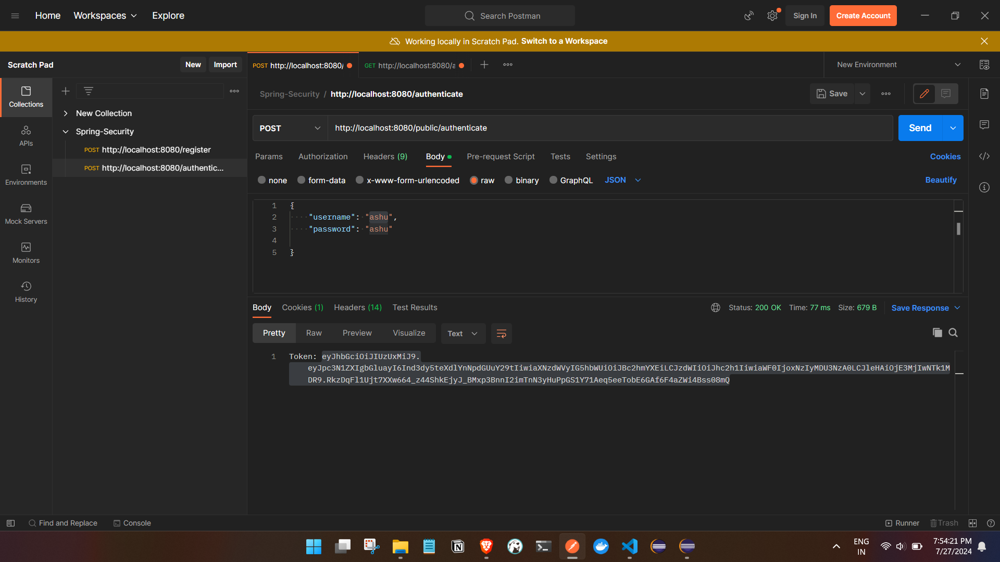
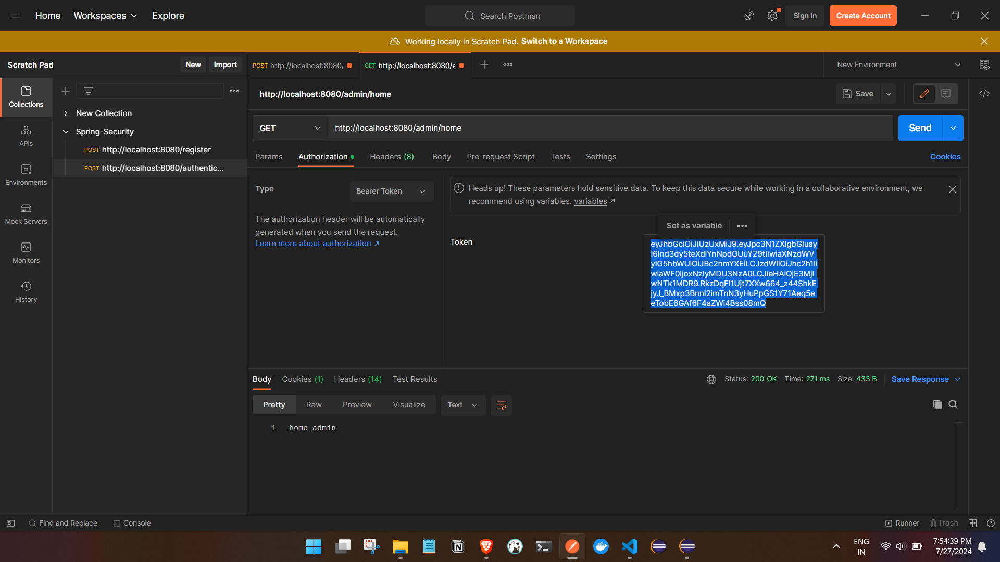
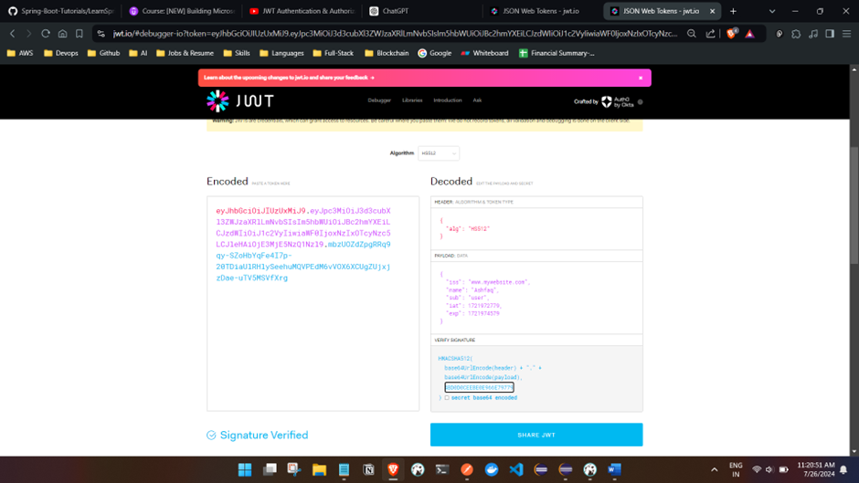
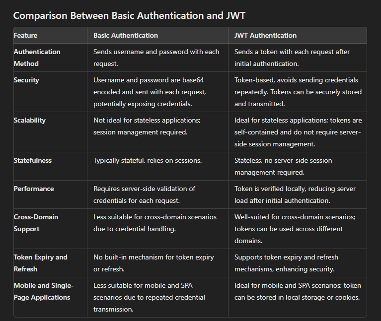

# JWT In Springboot
[Official Link](https://jwt.io/)


## Prerequities 

We have already configured basic authentication and authorization in springboot with a DB. 


## What is JWT (JSON Web Token)?
JWT stands for JSON Web Token. It is an open standard (RFC 7519) for securely transmitting information between parties as a JSON object. This information can be verified and trusted because it is digitally signed using a secret (with the HMAC algorithm) or a public/private key pair using RSA or ECDSA.


## Structure of a JWT

A JWT consists of three parts:

- Header: Contains metadata about the type of token and the signing algorithm used.
- Payload: Contains the claims, which are statements about an entity (typically, the user) and additional data.
- Signature: Ensures that the token wasn't altered. It is created by taking the encoded header, the encoded payload, a secret key, and signing them.

## JWT Working 


## Adding JWT Dependencies : 

```


		<!-- https://mvnrepository.com/artifact/io.jsonwebtoken/jjwt-api -->
<dependency>
    <groupId>io.jsonwebtoken</groupId>
    <artifactId>jjwt-api</artifactId>
    <version>0.12.5</version>
</dependency>


<!-- https://mvnrepository.com/artifact/io.jsonwebtoken/jjwt-impl -->
<dependency>
    <groupId>io.jsonwebtoken</groupId>
    <artifactId>jjwt-impl</artifactId>
    <version>0.12.6</version>
    <scope>runtime</scope>
</dependency>

<!-- https://mvnrepository.com/artifact/io.jsonwebtoken/jjwt-jackson -->
<dependency>
    <groupId>io.jsonwebtoken</groupId>
    <artifactId>jjwt-jackson</artifactId>
    <version>0.12.5</version>
    <scope>runtime</scope>
</dependency>
	
		
		

```


## Flow 

## 1 . Create Secret Key : 

```

	@Test
	public void generateSecretKey() {

		SecretKey secretKey = Jwts.SIG.HS512.key().build();// HMAC-SHA-512 Algorithm
		String encodedKey = DatatypeConverter.printHexBinary(secretKey.getEncoded());
		log.info("encodedKey Secret Key : " + encodedKey);
    //		2024-07-24T10:20:11.684+05:30  INFO 84340 --- [Spring-Boot-security-V3J21] [           main] com.ashfaq.example.JWTSecretMakerTest   
    //		: encodedKey Secret Key : 220A1EC50F1FCF5D547C8A78E0F459120780BB374FC9E1B90FCFCE3F1D14D6381733878836A5414C0A0B1250363144BE9B928F54304BD0D0CEEBE0E966E79779

	}

```


## 2 . Create Service class to create a token from secretKey , validatetoken , and util functions : 

```
package com.ashfaq.example.config.services;

import java.time.Instant;
import java.util.Base64;
import java.util.Date;
import java.util.HashMap;
import java.util.Map;
import java.util.concurrent.TimeUnit;

import javax.crypto.SecretKey;

import org.springframework.security.core.userdetails.UserDetails;
import org.springframework.stereotype.Service;

import io.jsonwebtoken.Claims;
import io.jsonwebtoken.Jwts;
import io.jsonwebtoken.security.Keys;

@Service
public class JWTService {

	private static final String SECRET_KEY = "220A1EC50F1FCF5D547C8A78E0F459120780BB374FC9E1B90FCFCE3F1D14D6381733878836A5414C0A0B1250363144BE9B928F54304BD0D0CEEBE0E966E79779";
	private static final long VALIDITY_OF_TOKEN = TimeUnit.MINUTES.toMillis(30);//30 mins conversion to millis

	public String generateToken(UserDetails userDetails) {

		// claims metadata of the token basically issuer name, site .....
		Map<String, Object> claims = new HashMap<>();
		claims.put("issuer link", "www.mywebsite.com");
		claims.put("issuer name", "Ashfaq");

		// token generation
		return Jwts.builder().
				claims(claims).//issuer of the token details we can pass here as well
				subject(userDetails.getUsername())// subject name will be username
				.issuedAt(Date.from(Instant.now())).
				expiration(Date.from(Instant.now().plusMillis(VALIDITY_OF_TOKEN)))// 30 mins is the expiration of the token
				.signWith(getSecretKey())// provide the secret key
				.compact(); // convert the token into String
		
	}

	// take the secretKey which was in String format and return it as Secret Key format
	private SecretKey getSecretKey() {
		// we will take our Secret key and decode it
		byte[] decode = Base64.getDecoder().decode(SECRET_KEY);
		SecretKey secretKey = Keys.hmacShaKeyFor(decode);
		return secretKey;
	}

	public String getUsernameFromJWTToken(String jwtToken) {
		Claims claims = getClaims(jwtToken);
		return claims.getSubject(); // as subject name will be username , we gave while token generation
	}

	private Claims getClaims(String jwtToken) {
		return Jwts.parser().verifyWith(getSecretKey()).build().parseSignedClaims(jwtToken).getPayload();//if we see in the JWT.io we can see the payload there will be details
	}

	
	//Validate Token like is token expired or not
	public boolean validateToken(String jwtToken) {
		Claims claims = getClaims(jwtToken);
		
		
		
		return claims.getExpiration().after(Date.from( Instant.now()));//simple check like the expiration date is after current date so its in future
	}

}


```

## 3 . Create CustomJWTfilter which will acts as validation : 
```

package com.ashfaq.example.config;

import java.io.IOException;

import org.springframework.beans.factory.annotation.Autowired;
import org.springframework.security.authentication.UsernamePasswordAuthenticationToken;
import org.springframework.security.core.context.SecurityContextHolder;
import org.springframework.security.core.userdetails.UserDetails;
import org.springframework.security.web.authentication.WebAuthenticationDetailsSource;
import org.springframework.stereotype.Service;
import org.springframework.web.filter.OncePerRequestFilter;

import com.ashfaq.example.config.services.JWTService;

import jakarta.servlet.FilterChain;
import jakarta.servlet.ServletException;
import jakarta.servlet.http.HttpServletRequest;
import jakarta.servlet.http.HttpServletResponse;

@Service
public class CustomJWTAuthenticationFilterChain extends OncePerRequestFilter {

	@Autowired
	private JWTService jwtService;

	@Autowired
	private CustomUserDetailService customUserDetailService;

	// this method will be called for every request but we have to get it from
	// OncePerRequestFilter class

	@Override
	protected void doFilterInternal(HttpServletRequest request, HttpServletResponse response, FilterChain filterChain)
			throws ServletException, IOException {

		String authHeader = request.getHeader("Authorization");

		//so in every req we see if we have a authheader and if we dont have we will continue and wont check  anything 
		if (authHeader == null || !authHeader.startsWith("Bearer ")) {

			filterChain.doFilter(request, response);
			// if the header is not present or not start with Bearer then we ignore the
			// request and continue
			return;

		}
		// if the authHeader contains Bearer then we will get the JWTtoken
		String jwtToken = authHeader.substring(7); // as in header it will be like Bearer 'token' so 6 words and 1 space
		// now from the token we have to get userName

		String username = jwtService.getUsernameFromJWTToken(jwtToken);

		// if the user is not null and not logged in , if he is already logged or
		// authenticated no need to authenticate again with JWT tokn
		if (username != null && SecurityContextHolder.getContext().getAuthentication() == null) {

			// validate the user from our userdetails Service as this will check in DB
			UserDetails userDetails = customUserDetailService.loadUserByUsername(username);

			if (userDetails != null && jwtService.validateToken(jwtToken)) {

				UsernamePasswordAuthenticationToken authenticationToken = new UsernamePasswordAuthenticationToken(
						username, // user name
						userDetails.getPassword(), // password
						userDetails.getAuthorities());// roles of the user
				authenticationToken.setDetails(new WebAuthenticationDetailsSource().buildDetails(request));//by doing this 
				//we can see the details of the user like his IP , and track user for spam check , or DDOS attack **Details of the client

				SecurityContextHolder.getContext().setAuthentication(authenticationToken);
			}

		}
		filterChain.doFilter(request, response);// one above filter is done then to proceed with the next respective filter

	}

}


```
## 4 . Modify Security Config : 
```
@Autowired
	private CustomJWTAuthenticationFilterChain JWTauthenticationFilterChain;

	
	@Bean
	public SecurityFilterChain securityFilterChain(HttpSecurity httpSecurity) throws Exception {
		other configs.....
	//JWT authentication filter
		httpSecurity.addFilterBefore(JWTauthenticationFilterChain, UsernamePasswordAuthenticationFilter.class);//our JWT customfilter should be called before UsernamepasswordAuthenticationFilter class

		return httpSecurity.build();

	}


	// JWT process for generating token
	@Bean
	public AuthenticationManager authenticationManager() {
		return new ProviderManager(authenticationProvider());
	}


```
## 5 .API which takes cred and gives back JWT token :

```
	@PostMapping("/authenticate")//this is a public API
	public ResponseEntity<String> authAndGetTokenold(@RequestBody LoginForm loginFormuser) {

		Authentication authenticationResult = authenticationManager.authenticate(
				new UsernamePasswordAuthenticationToken(loginFormuser.username(), loginFormuser.password()));

//		log.info(authenticationResult.toString() + "authenticationResult ************");
		
		if (authenticationResult.isAuthenticated()) {
			// we need to return JWT token

			UserDetails userDetails = userDetailService.loadUserByUsername(loginFormuser.username());
//			log.info(loginFormuser.username() + "User found in database ************");

			String jwtToken = jwtService.generateToken(userDetails);// this functions takes Userdetails param and we
			// have loginform with username and pwd ,
			// so we will use CusotmuserDetailService funciont which takes username
			// validates and returns Userdetails

			return ResponseEntity.ok().body("Token: " + jwtToken);

		} else {

			throw new RuntimeException("Invalid username or password" + loginFormuser.username());// this wont work as if auth is failed 
			//directly we get 401 error

		}

	}
```

###  Run the code , create users , call /authenticate and get token and call the api's

- eg :




- test with other roles as well, call public api's and role based api's as well

 - Our Token  : 
 

 ## Why Use JWT?
1. Statelessness
JWTs are self-contained: They carry all the information needed for authentication, reducing the need for server-side session storage.
Scalable: Ideal for distributed systems and microservices since they eliminate the need for session management and centralized session stores.
2. Security
Reduces credential exposure: Credentials are exchanged only once during authentication. Subsequent requests use the token, minimizing the risk of exposing sensitive information.
Token expiration: JWTs can have expiration times (exp claim), limiting the window of opportunity for attackers if the token is compromised.
Signature verification: The token’s signature ensures that the token hasn’t been tampered with.
3. Performance
Local verification: The server can verify the token without needing to query a database, leading to faster authentication.
Reduced load: By not storing sessions on the server, the load on the server is reduced, especially beneficial for high-traffic applications.
4. Flexibility and Interoperability
Cross-domain and cross-origin support: JWTs can be used in a variety of contexts, including APIs, web applications, and mobile apps.
Language-agnostic: JWTs are based on JSON and are supported by many programming languages, making them ideal for diverse environments.
5. Token Expiry and Revocation
Token lifespan management: Tokens can be issued with expiration times, enhancing security by ensuring tokens are only valid for a limited period.
Refresh tokens: Allows users to obtain a new token without re-authenticating, improving user experience and security.
6. Use Cases
Authentication: Secure user authentication in web and mobile applications.
Authorization: Grant access to resources based on the token’s claims.
Information Exchange: Securely transmit information between different parties.
Practical Examples of JWT Usage
Single Sign-On (SSO): JWTs are widely used in SSO systems because they allow users to authenticate once and gain access to multiple applications.
API Authentication: Many APIs use JWTs to secure endpoints, ensuring that only authorized clients can access specific resources.
Microservices Communication: In a microservices architecture, JWTs can be used to secure communication between services, providing a way to verify the identity of each service.

### Conclusion
- JWTs provide a secure, efficient, and flexible way to handle authentication and authorization in modern applications. Their self-contained nature and statelessness make them particularly well-suited for distributed systems and microservices, offering significant advantages over traditional session-based authentication methods.




### Why Use JWT Over Basic Authentication?

- Statelessness:

JWTs are self-contained tokens that include all necessary information about the user.
This makes them perfect for stateless applications where no session state is stored on the server.

- Security:

Basic Authentication sends the username and password encoded (but not encrypted) with every request. If the connection is not secure (e.g., no HTTPS), credentials can be easily intercepted.
JWTs avoid sending credentials repeatedly. Instead, a token is issued after initial authentication and used for subsequent requests.

- Scalability:

JWTs are easily scalable since they do not rely on server-side session management. The server does not need to keep track of active sessions, which is beneficial for distributed systems and microservices.

- Cross-Domain Requests:

JWTs are ideal for cross-domain authentication, such as in Single Page Applications (SPAs) and mobile applications, where Basic Authentication would be less secure and harder to manage.

- Token Expiry:

JWTs have an expiry mechanism (exp claim) which can enhance security by limiting the lifetime of tokens. After the token expires, the user needs to authenticate again to get a new token.
Tokens can also be refreshed using refresh tokens without requiring the user to log in again, improving the user experience.

- Performance:

After the initial authentication, JWTs can be validated locally by verifying the signature, which reduces the load on the server.