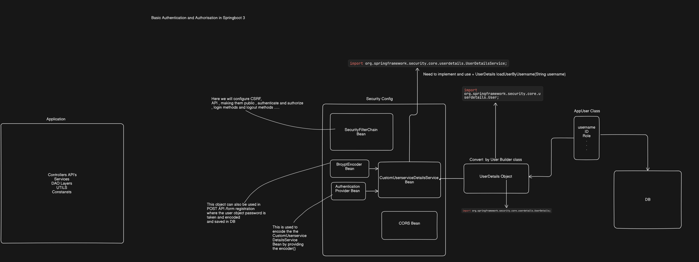

#Things to know 

When you manually insert data into the database and cannot log in, it is usually due to the password not being encoded correctly. Spring Security uses the PasswordEncoder (in your case, BCryptPasswordEncoder) to hash passwords before storing them in the database. Here are the main points to consider:

Reasons for Login Failure with Manually Inserted Data
Password Encoding:

When you manually insert a user into the database, you need to ensure the password is BCrypt hashed.
Example: INSERT INTO app_user (id, password, role, username) VALUES (1, '$2a$10$DOWSDfHHRv7K7m0aN7X1se1ZJo8kWTeQPOtSx1EoI8YPuO.bYZsS.', 'ADMIN,USER', 'ashfaq');
The string $2a$10$DOWSDfHHRv7K7m0aN7X1se1ZJo8kWTeQPOtSx1EoI8YPuO.bYZsS. is an example of a BCrypt hashed password.
Password Hashing:

If the password is not hashed, the authentication process will fail because Spring Security will hash the password provided during login and compare it to the stored (plaintext) password, which will not match.
BCrypt hashes look like $2a$10$....
Consistent Role Definition:

Ensure that roles are consistently defined and assigned. The roles should match what you have configured in your Spring Security configuration.


### Class Intro 
This is the class , which we need to finally give so we have to convert our AppUser custom class 
which has all the properties (username,password,role...) to UserDetails class and then we have to return it as a userdetails object.
we have to return in CustomUserdetails Service class.


```


public interface UserDetails extends Serializable {

	/**
	 * Returns the authorities granted to the user. Cannot return <code>null</code>.
	 * @return the authorities, sorted by natural key (never <code>null</code>)
	 */
	Collection<? extends GrantedAuthority> getAuthorities();

	/**
	 * Returns the password used to authenticate the user.
	 * @return the password
	 */
	String getPassword();

	/**
	 * Returns the username used to authenticate the user. Cannot return
	 * <code>null</code>.
	 * @return the username (never <code>null</code>)
	 */
	String getUsername();

	/**
	 * Indicates whether the user's account has expired. An expired account cannot be
	 * authenticated.
	 * @return <code>true</code> if the user's account is valid (ie non-expired),
	 * <code>false</code> if no longer valid (ie expired)
	 */
	default boolean isAccountNonExpired() {
		return true;
	}

	/**
	 * Indicates whether the user is locked or unlocked. A locked user cannot be
	 * authenticated.
	 * @return <code>true</code> if the user is not locked, <code>false</code> otherwise
	 */
	default boolean isAccountNonLocked() {
		return true;
	}

	/**
	 * Indicates whether the user's credentials (password) has expired. Expired
	 * credentials prevent authentication.
	 * @return <code>true</code> if the user's credentials are valid (ie non-expired),
	 * <code>false</code> if no longer valid (ie expired)
	 */
	default boolean isCredentialsNonExpired() {
		return true;
	}

	/**
	 * Indicates whether the user is enabled or disabled. A disabled user cannot be
	 * authenticated.
	 * @return <code>true</code> if the user is enabled, <code>false</code> otherwise
	 */
	default boolean isEnabled() {
		return true;
	}

}

```

## High level Overview Of Springboot Security Basic Authentication and Authorization 


----